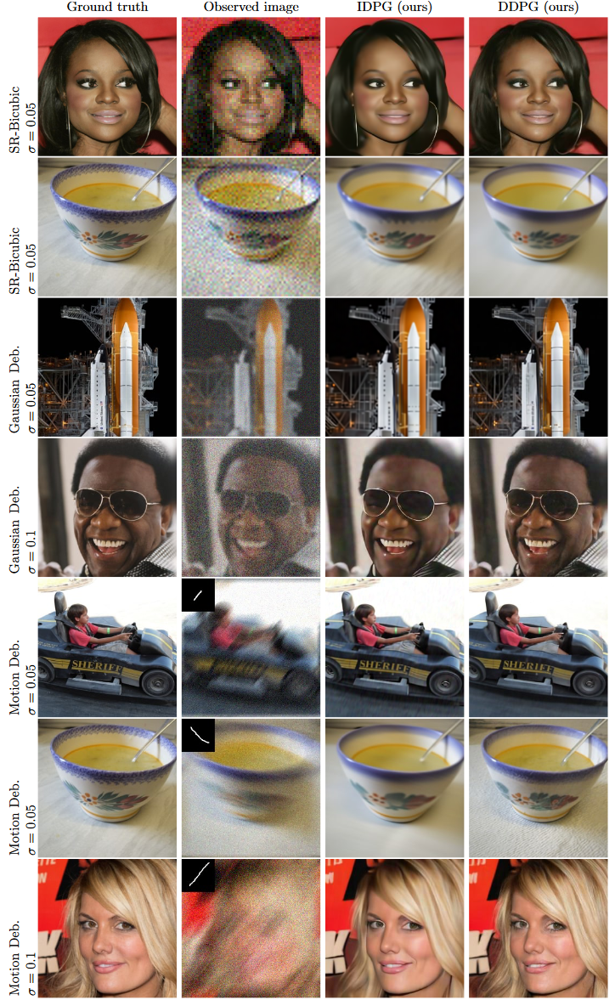

# Image Restoration by Denoising Diffusion Models with Iteratively Preconditioned Guidance

## 📖[**Paper**](https://arxiv.org/pdf/2312.16519.pdf)

Tomer Garber, [Tom Tirer](https://scholar.google.com/citations?user=_6bZV20AAAAJ)

The Open University of Israel and Bar-Ilan University

# Introduction

This repository contains the code release for *Image Restoration by Denoising Diffusion Models with Iteratively
Preconditioned Guidance* (***DDPG***).

## Abstract

Training deep neural networks has become a common approach for addressing image restoration problems. An alternative for
training a “task-specific” network for each observation model is to use pretrained deep denoisers for imposing only the
signal’s prior within iterative algorithms, without additional training.

Recently, a sampling-based variant of this approach has become popular with the rise of diffusion/score-based generative
models.
Using denoisers for general purpose restoration requires guiding the iterations to ensure agreement of the signal with
the observations.

In low-noise settings, guidance that is based on backprojection (BP) has been shown to be a promising strategy
(used recently also under the names “pseudoinverse” or “range/null-space” guidance). However, the presence of noise in
the observations hinders the gains from this approach. In this paper, we propose a novel guidance technique,
based on preconditioning that allows traversing from BP-based guidance to least squares based guidance along the
restoration scheme.

The proposed approach is robust to noise while still having much simpler implementation than alternative methods
(e.g., it does not require SVD or a large number of iterations). We use it within both an optimization scheme and a
sampling-based scheme, and demonstrate its advantages over existing methods for image deblurring and super-resolution.

## Supported degradations

1. Super-Resolution (Bicubic)
2. Gaussian Deblurring
3. Motion Deblurring

# Setup

## Installation

### Clone this repository

To clone this repository and the code, run:

```bash
git clone https://github.com/tirer-lab/DDPG.git

```

### Environment

There are several dependencies required, and you may install it via *pip* or *docker*.
The code was tested on Python 3.8 and PyTorch 1.9.0.

#### Pip

```
pip install torch torchvision lpips numpy tqdm pillow blobfile pyYaml pandas scipy opencv-python 
```

Download the relevant torch and torchvision according to your setup, for example:

```
pip install torch==1.9.0+cu111 torchvision==0.10.1+cu111 -f https://download.pytorch.org/whl/torch_stable.html

```

#### Docker

The repository contains [Dockerfile](Dockerfile), in order to use it run (after cloning this repo and `cd` to it):

```bash
docker build .
```

If you wish to run *IDPG* instead of *DDPG*, You can swap the [`CMD`](Dockerfile#L9) commands in the Docker file.

## Motion Deblur

For motion deblur we used the following git repository to generate the
kernels: https://github.com/LeviBorodenko/motionblur.

Clone that repository and copy the *motionblur.py* file into `DDPG/functions`.

As mentioned in the paper, we used motion deblur kernels with `intensity=0.5`.

## Datasets

The datasets used in the paper are CelebA-HQ and ImageNet. Both can be found in: 
[[Google drive](https://drive.google.com/drive/folders/1cSCTaBtnL7OIKXT4SVME88Vtk4uDd_u4?usp=sharing)] [[Baidu drive](https://pan.baidu.com/s/1tQaWBqIhE671v3rrB-Z2mQ?pwd=twq0)].

After you download the datasets, place each dataset in the relevant directory:

1. CelebA-HQ - Place the dataset in `DDPG/exp/datasets/celeba/`.
2. ImageNet -  Place the dataset in `DDPG/exp/datasets/imagenet/`.
   1. Download the file `imagenet_val_1k.txt` from the links above as well, and place it in `DDPG/exp`. Rename this file to `imagenet_val.txt` in order for the code to use it.

## Pre-Trained Models

To download the models used in the paper:

### CelebA-HQ

The CelebA-HQ model checkpoint can be
found [here](https://drive.google.com/file/d/1wSoA5fm_d6JBZk4RZ1SzWLMgev4WqH21/view?usp=share_link).
Download it and place it in `DDPG/exp/logs/celeba/`.

### ImageNet
The ImageNet model checkpoint can be
found [here](https://openaipublic.blob.core.windows.net/diffusion/jul-2021/256x256_diffusion_uncond.pt).
Download it and place it in `DDPG/exp/logs/imagenet/`.

## Parameters

The general python command to run the code is:
```
python main.py --config {config}.yml --path_y {dataset_folder} --deg {deg} --sigma_y {sigma_y}
-i {image_folder} --inject_noise {inject_noise} --gamma {gamma} --zeta {zeta} --eta_tilde {eta_tilde}
--step_size_mode {step_size_mode} --operator_imp {operator_implementation} --save_y {save_observation}
--scale_ls {scale_for_gLS}
```

Where:

- `config`: The name of the yml to use to configure the model used.
- `dataset_folder`: The name of the directory containing the image dataset.
- `deg`: the degradation type to use. Used in paper: `sr_bicubic`, `deblur_gauss`, `motion_deblur`
    - When using `sr_bicubic`, the flag `--deg_scale 4` is also required
- `sigma_y`: Noise level. Noise levels used in paper: `0, 0.01, 0.05, 0.1`.
- `image_folder`: Name of directory for output images.
- `inject_noise`: Whether to inject noise (1) and run *DDPG* or not (0) and run *IDPG*.
- `gamma`: The Gamma hyperparameter used in the paper.
- `zeta`: The Zeta hyperparameter used in the paper.
- `eta_tilde`: The Eta hyperparameter used in the paper.
    - Instead of `eta_tilde`, `xi` can be used, but `eta_tilde` must be set to negative number for `xi` to be noted.
- `step_size_mode`: Which step size mode to use. In the paper, `step_size_mode=0` (fixed 1) was used for IDPG, noiseless DDPG and 
DDPG with noise level `0.01`. `step_size_mode=1` (certain decay) was used for the rest of the DDPG runs.
- `operator_implementation` - Whether to use `SVD` or `FFT`. Defaults to `FFT`.
- `scale_ls` - The `c` hyperparameter used in the paper, which is Least Squares guidance scale. Defaults to `1`. 
- `save_observation` - Whether to save the observation (`y`) or not. Defaults to `False`.


Additionally, you can configure the sampling steps (defaults to `100` in the paper). In each yml config under `configs` directory
(`celeba_hq.yml`, `imagenet_256.yml` and `imagenet_256_cc.yml`) you may change:
```yaml
sampling:
  T_sampling: <desired_sampling_steps>
```

## Evaluation

In order to reproduce the paper's results, there are 2 evaluation scripts:

1. [evaluation_DDPG.sh](evaluation_DDPG.sh) for *DDPG* results.
2. [evaluation_IDPG.sh](evaluation_IDPG.sh) for *IDPG* results.

Both scripts contain all tasks mentioned in the paper with the relevant configuration.

## Qualitative Results



Additional results can be found in the paper, including PSNR and LPIPS results compared to competitors.
## Citations
If you used this repository in you research, please cite the paper:
```
@article{tom2023image,
  title={Image Restoration by Denoising Diffusion Models with Iteratively Preconditioned Guidance},
  author={Garber, Tomer and Tirer, Tom},
  journal={The Computer Vision and Pattern Recognition},
  year={2024}
}
```
## Acknowledgements

This repository is based on:
1. https://github.com/wyhuai/DDNM - Base code, CelebA-HQ pre-trained model and datasets.
2. https://github.com/LeviBorodenko/motionblur - Motion deblur implementation.
3. https://github.com/openai/guided-diffusion - ImageNet pre-trained model.
